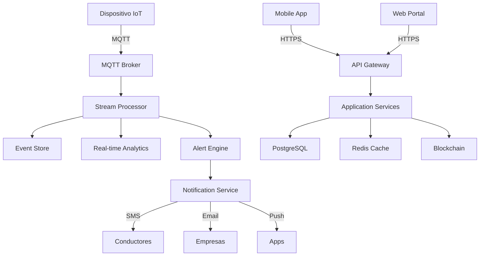

# Arquitectura del Sistema SISTRAU

## Visión General

SISTRAU está diseñado como un sistema distribuido y modular que integra múltiples tecnologías para proporcionar un control integral del transporte de carga en Uruguay.

## Componentes Principales

### 1. Dispositivos IoT en Vehículos
- **GPS de Alta Precisión**: Trackeo en tiempo real
- **Sensores de Peso**: Monitoreo de carga por eje
- **Lector Biométrico**: Identificación de conductores
- **Acelerómetro**: Detección de conducción brusca
- **OBD-II Interface**: Diagnóstico del vehículo
- **Comunicación**: 4G/5G con fallback a 3G

### 2. Backend Core (Node.js)
```
├── API Gateway
│   ├── Autenticación JWT
│   ├── Rate Limiting
│   └── Request Validation
├── Microservicios
│   ├── Vehicle Service
│   ├── Driver Service
│   ├── Cargo Service
│   ├── Route Service
│   └── Alert Service
├── Message Queue (RabbitMQ)
├── Cache Layer (Redis)
└── Database Layer (PostgreSQL)
```

### 3. Blockchain Layer
- **Smart Contracts**: Para registros inmutables
- **Red**: Ethereum privada o Hyperledger Fabric
- **Funciones**:
  - Registro de viajes
  - Validación de guías de carga
  - Auditoría de eventos críticos

### 4. Frontend Applications

#### Panel de Control Web (React)
- Dashboard para transportistas
- Panel administrativo MTOP
- Vista para sindicatos
- Portal público de consultas

#### Aplicación Móvil
- React Native para iOS/Android
- Funciones para conductores
- Escaneo de documentos
- Alertas push

### 5. Integraciones Externas
- **DGI**: Validación fiscal
- **BPS**: Control de aportes
- **Aduana**: Cargas internacionales
- **Policía Caminera**: Infracciones
- **ANP**: Operaciones portuarias

## Flujo de Datos



## Seguridad

### Capas de Seguridad
1. **Dispositivos**: Firmware firmado, comunicación cifrada
2. **Red**: VPN, SSL/TLS, certificados mutuos
3. **Aplicación**: OAuth 2.0, JWT, RBAC
4. **Datos**: Encriptación en reposo y tránsito
5. **Blockchain**: Consenso distribuido

### Cumplimiento Normativo
- GDPR / Ley 18.331 (Protección de datos)
- ISO 27001 (Seguridad de la información)
- PCI DSS (Si se procesan pagos)

## Escalabilidad

### Horizontal Scaling
- Kubernetes para orquestación
- Auto-scaling basado en métricas
- Load balancers geográficos

### Vertical Scaling
- Bases de datos particionadas
- Sharding por región/empresa
- Read replicas para consultas

## Alta Disponibilidad

- **RPO**: < 15 minutos
- **RTO**: < 1 hora
- **Uptime objetivo**: 99.9%

### Estrategias
- Multi-region deployment
- Database replication
- Backup automático cada 6 horas
- Disaster recovery plan

## Monitoreo y Observabilidad

### Herramientas
- **Prometheus**: Métricas del sistema
- **Grafana**: Dashboards de monitoreo
- **ELK Stack**: Logs centralizados
- **Jaeger**: Distributed tracing

### Métricas Clave
- Latencia de API (p50, p95, p99)
- Throughput de mensajes IoT
- Disponibilidad de servicios
- Uso de recursos

## Principios de Diseño

1. **Modularidad**: Componentes independientes
2. **Resiliencia**: Tolerancia a fallos
3. **Transparencia**: Auditable y trazable
4. **Eficiencia**: Optimizado para alto volumen
5. **Usabilidad**: Interfaces intuitivas
6. **Privacidad**: Privacy by design

## Tecnologías Clave

### Backend
- Node.js 18+ con TypeScript
- Express.js / Fastify
- PostgreSQL 15+
- Redis 7+
- RabbitMQ / Apache Kafka

### Frontend
- React 18+
- Material-UI / Ant Design
- Redux Toolkit
- React Query
- Mapbox GL JS

### DevOps
- Docker & Kubernetes
- GitLab CI/CD
- Terraform
- Ansible
- ArgoCD

### Blockchain
- Solidity (Smart Contracts)
- Web3.js / Ethers.js
- IPFS para almacenamiento

## Roadmap Técnico

### Fase 1 (MVP)
- [ ] Core API
- [ ] Basic Web Portal
- [ ] GPS Tracking
- [ ] User Management

### Fase 2
- [ ] Mobile Apps
- [ ] Advanced Analytics
- [ ] Blockchain Integration
- [ ] Third-party APIs

### Fase 3
- [ ] AI/ML Features
- [ ] Predictive Maintenance
- [ ] Route Optimization
- [ ] Regional Expansion